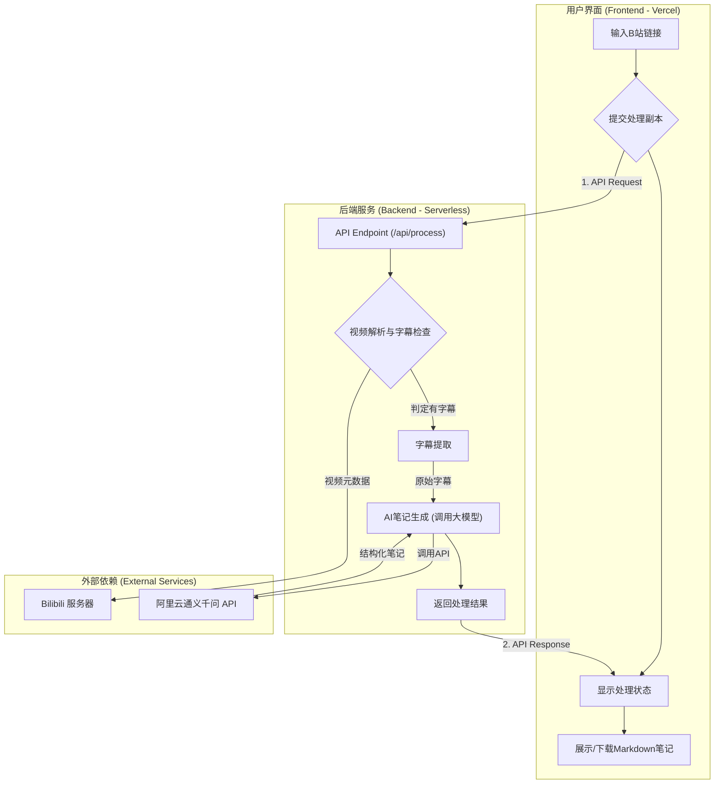

### **产品需求文档 (PRD): B站字幕提取

### 1. 项目背景与目标 (Background & Goals)

#### **1.1 项目背景**
在信息爆炸的时代，B站已成为知识获取的重要平台。然而，用户在学习过程中普遍面临“一看就懂，一关就忘”的困境。手动记录视频笔记的过程繁琐、效率低下，严重影响学习的连贯性。本项目旨在通过AI技术，自动化地将B站视频内容转化为结构化的学习笔记，帮助用户高效地沉淀和内化知识。

#### **1.2 项目目标**
* **用户价值：** 将用户从繁重的重复性劳动中解放出来，提供一种“一键化”的视频学习笔记生成体验，将视频的被动观看转化为知识的主动吸收。
* **商业目标 (MVP阶段)：** 快速上线核心功能，验证产品核心价值，收集早期用户反馈，为后续版本迭代和功能扩展（如无字幕视频处理、个性化总结等）打下基础。成功的标准是用户能够持续使用产品，并愿意将其分享给他人。

### 2. 用户故事 (User Stories)

1. **作为一个在校大学生**，我想要快速将B站上的考研课程视频转换成带章节大纲和重点总结的笔记，以便于我能节省整理时间，把更多精力放在复习和做题上。
2. **作为一个职场程序员**，我想要把B站上技术分享类视频的核心内容（例如关键代码逻辑、架构思想）提取出来，以便于我能快速回顾和查阅，并应用到实际工作中。
3. **作为一个内容研究者**，我想要批量处理一系列B站访谈或纪录片，自动生成每期内容的结构化文本和摘要，以便于我进行快速的内容分析和素材整理。

### 3. 功能架构图 (Functional Architecture Diagram)

### 4. 核心功能需求 (Functional Requirements)

#### **FR-01: 视频链接输入与解析**
* **FR-1.1:** 前端页面提供一个清晰的输入框，供用户粘贴B站视频链接（兼容格式如 `bilibili.com/video/BV...`，`b23.tv/...` 等）。
* **FR-1.2:** 后端接收到链接后，能有效解析出视频的唯一标识（BVID/AV号）。
* **FR-1.3:** 后端需要能访问B站接口，验证视频的有效性，并判断该视频是否包含可提取的CC字幕。
* **FR-1.4 (MVP):** 如果检测到视频**没有**自带字幕，应在前端明确提示用户：“该视频暂无字幕，处理功能将在未来版本支持。”

#### **FR-02: 字幕提取与AI处理**
* **FR-2.1:** 后端成功解析视频后，自动抓取其对应的完整字幕文本数据。
* **FR-2.2:** 将提取到的原始字幕文本（可能包含时间戳和格式问题）进行初步清洗，整合成一个干净的文本字符串。
* **FR-2.3:** 调用**通义千问**大语言模型API，并使用精心设计的Prompt（指令），对干净的文本进行处理。该Prompt应指示模型完成以下任务：
 * **任务一：识别主题并生成大纲。** 分析全文，划分出合乎逻辑的段落和主题，并生成带有多级标题的Markdown大纲。
 * **任务二：提炼核心摘要。** 在笔记的开头，生成一段约150字的核心内容摘要（Summary）。
 * **任务三：总结关键要点。** 在笔记的结尾，以无序列表的形式，提炼出3-5个最重要的关键知识点（Key Takeaways）。
* **FR-2.4:** 后端需要处理AI模型的API调用，包括请求、等待响应和错误处理。

#### **FR-03: 结果展示与下载**
* **FR-3.1:** 当前端收到处理完成的信号后，在一个美观、易于阅读的区域展示生成的Markdown笔记内容（需要支持Markdown格式的渲染）。
* **FR-3.2:** 提供一个明显的“复制内容”按钮，方便用户一键复制代码。
* **FR-3.3:** 提供一个“下载.md文件”按钮，让用户可以将笔记保存到本地。

### 5. 非功能性需求 (Non-Functional Requirements)

* **性能 (Performance):** 从用户提交链接到返回结果，对于一个15分钟的视频，处理总时长应控制在30秒以内。需要对API调用进行异步处理，避免页面假死。
* **用户体验 (UX):** 界面设计简洁明了，操作引导清晰。在等待AI处理期间，必须有明确的加载动画或进度提示，缓解用户焦虑。
* **兼容性 (Compatibility):** 网站应在主流浏览器（Chrome, Safari, Edge）的最新版本上表现良好，并具备基本的移动端响应式布局。
* **安全性 (Security):** 对用户输入的所有内容进行基础的XSS过滤，防止恶意代码注入。所有与外部API的通信应使用HTTPS。

### 6. 推荐技术栈 (Recommended Tech Stack)

* **前端 (Frontend):**
 * **框架:** **Next.js (React)**。理由：完美契合Vercel部署平台，提供优秀的SSR（服务器端渲染）和SSG（静态站点生成）能力，对SEO友好。组件化的开发模式和丰富的生态系统能极大提升开发效率。
 * **UI库:** **Tailwind CSS** 或 **shadcn/ui**。理由：提供原子化的CSS类，能快速构建现代化且高度可定制的界面，避免编写大量CSS代码。
* **后端 (Backend):**
 * **架构:** **Serverless Functions (on Vercel)**。理由：既然前端部署在Vercel，使用其自带的Serverless Functions是最自然的选择。无需管理服务器，按需付费，与前端代码库整合度高，极大简化了开发和运维。
 * **语言:** **TypeScript (or JavaScript)**。理由：与前端保持语言统一，降低团队学习成本，实现全栈开发。TypeScript的强类型特性有助于提升代码的健壮性和可维护性。
* **部署 (Deployment):**
 * **平台:** **Vercel**。理由：用户指定要求。提供从Git仓库一键部署、自动CI/CD、全球CDN加速等功能，是部署Next.js应用的最佳实践。

### 7. 分步执行计划 (Step-by-Step Implementation Plan)

#### **第一阶段：MVP版本 (预计2-3周)**
* **Week 1: 前后端基础架构搭建**
 * [ ] 初始化Next.js项目，配置TypeScript和Tailwind CSS。
 * [ ] 创建基本的页面布局，包括输入框、提交按钮和结果展示区。
 * [ ] 在Vercel上创建项目，实现Git Push自动部署。
 * [ ] 编写一个简单的Serverless Function (`/api/process`)，并完成前后端联调。
* **Week 2: 核心功能开发**
 * [ ] 实现B站链接解析和字幕提取模块。
 * [ ] 集成阿里云通义千问SDK/API，编写核心的Prompt。
 * [ ] 实现完整的后端处理逻辑：接收链接 -> 提取字幕 -> 调用AI -> 返回结果。
 * [ ] 实现前端等待状态的UI（加载动画）。
* **Week 3: 功能完善与测试**
 * [ ] 实现Markdown结果的渲染、复制和下载功能。
 * [ ] 编写并优化针对不同类型视频的Prompt模版。
 * [ ] 进行全面的功能测试和UI/UX优化。
 * [ ] **MVP版本正式上线。**

#### **第二阶段：迭代版本1 (MVP上线后)**
* [ ] **用户反馈收集：** 增加一个简单的反馈渠道，收集用户意见。
* [ ] **关键功能：无字幕视频处理**
 * [ ]
 研究可靠的第三方视频下载方案或库。
 * [ ]
 集成阿里云**通义听悟**API，实现音视频转文字功能。
 * [ ]
 将新的处理流程整合进现有架构中。
* [ ] **体验优化：** 增加处理历史记录功能。

---
